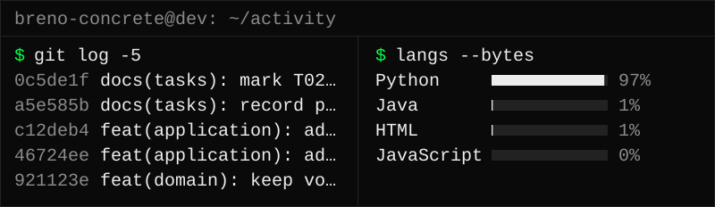

<div align="center">


</div>

### `whoami`

```text
Software Engineering student at UnB. Backend intern at a federal agency.
Java, Spring Boot, PostgreSQL. Auth and data integrity come first.
# git blame will find me either way
```

### `~/stack`

```text
~/stack
├── backend
│   ├── Java 21
│   ├── Spring Boot
│   └── also: Python, C
├── data
│   ├── PostgreSQL
│   └── Redis
├── infra
│   ├── Docker
│   ├── GitHub Actions (CI/CD)
│   └── AWS              [studying]
└── frontend
    ├── React            [in progress]
    └── TypeScript       [in progress]   // reading docs, shipping later
```

### `~/activity`



### `~/contact`

<a href="mailto:brenocountl@egmial.com"></a><br>
<a href="https://www.linkedin.com/in/breno-gomes-cardoso/"></a><br>
<a href="https://leetcode.com/u/breno-concrete/"></a>

<div align="center">

`exit 0`

</div>